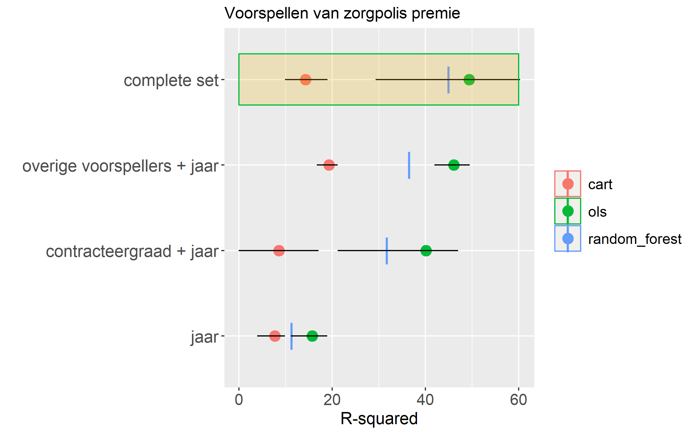

# Analyse code voor Pilot clientprofielen wijkverpleging

Deze repository bevat het framework dat gebruikt is om de analyses te doen 
voor het onderzoek **Pilot clientprofielen wijkverpleging**. 
De resultaten van dit onderzoek staan beschreven in het [onderzoeksrapport "Pilot clientprofielen wijkverpleging"](https://puc.overheid.nl/nza/doc/PUC_323325_22/1/).
De code is geschreven in R, en maakt gebruik van [R Markdown Notebooks](https://rmarkdown.rstudio.com/).

Met de analyse code in deze repository kan de voorspelkracht van  verschillende groepen van cliëntkenmerken in kaart gebracht worden. Hiertoe worden voorspelmodellen gemaakt met drie verschillende methodes (CART beslisbomen, Random forest algoritme, en multivariate regressie). Op deze manier krijgen we een globaal beeld van hoeveel voorspelkracht de verschillende bronnen van cliëntkenmerken bevatten. 

## Voorbeeld: Een voorspelmodel van zorgpolis premie

De dataset nodig om de resultaten uit het onderzoeksrapport te reproduceren bevat persoonsgegevens en kan daarom niet openbaar gemaakt worden. We hebben de code daarom (beperkt) aangepast zodat deze met een publiek beschikbare dataset werkt. 
Hierdoor kan iedereen de code uitvoeren en zien hoe de modellen worden gemaakt en de voorspelkracht berekend wordt.

Als voorbeeld hebben we een publiek beschikbare dataset met zorgpolis kenmerken gekozen die de NZa in 2019 heeft gepubliceerd op haar Github Repository. Deze dataset bevat data over zorgpolissen voor de jaren 2016-2018, waaronder de premie (prijs) en een aantal kenmerken van elke zorgpolis, b.v. of het een Natura, Combinatie of Restitutie polis is.

In `datasources/download_datasets.R` wordt de data gedownload van de NZa Github repository en uitgesplitst naar zorgverzekeraar (groep).
Dit vormt het startpunt voor ons voorbeeld.

In dit voorbeeld gaan we deze afzonderlijke "gegevensleveringen" van de zorgverzekeraars samenvoegen tot 1 dataset en hier voorspelmodellen op bouwen. De voorspelmodellen voorspellen de polispremie (prijs) uit de poliskenmerken.

We delen de voorspellers op in vier groepen. 
Zo kunnen we leren hoe groepen voorspellers bijdragen aan de voorspelkracht.

Deze figuur bevat het uiteindelijke resultaat:

Voor een uitgebreidere toelichting van de code zie `master.Rmd`.

